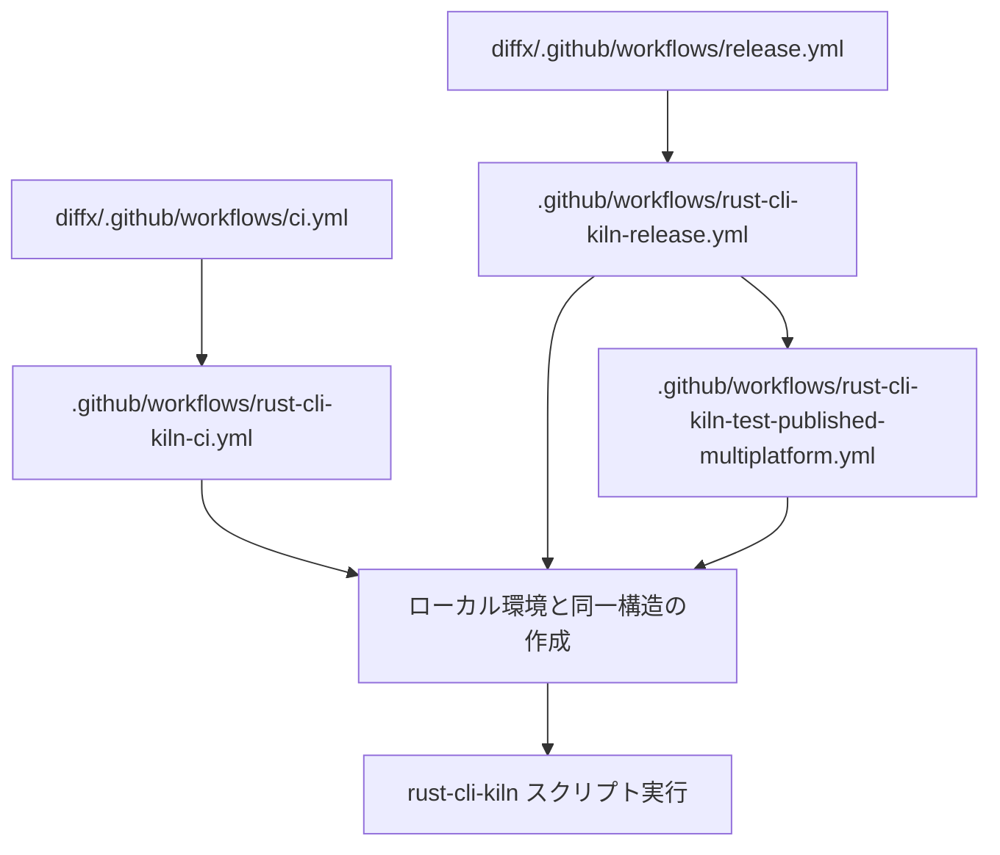

# GitHub Actions ワークフロー アーキテクチャ設計書

*rust-cli-kiln 統合リリースシステムの内部設計ドキュメント*

## 概要

3プロジェクト（lawkit, diffx, diffai）の統合リリースを実現するGitHub Actionsワークフローシステムの設計思想と実装詳細を説明します。

## アーキテクチャ原則

### 設計思想

1. **統一環境の原則**: ローカル開発環境とGitHub Actions環境で完全に同一の構造を維持
2. **シンプル化の原則**: 複雑なパス解決や動的検出を避け、確実性を重視
3. **再利用性の原則**: 既存のスクリプトを最大限活用し、新規コード量を最小化

### 廃止された設計

**当初計画（廃止）**: `.github`リポジトリから3プロジェクトを指定してワークフロー実行
- **問題**: プロジェクト選択のドロップダウン実装が複雑
- **決定**: シンプル化のため、各プロジェクトリポジトリから実行する方式に変更

## ワークフローチェイン設計

### 実行フロー



### ワークフローの種類

#### 1. CI ワークフロー (`rust-cli-kiln-ci.yml`)
- **目的**: ビルドとテストの実行
- **トリガー**: push, pull_request, workflow_dispatch
- **実行内容**: `05-build-and-test.sh`

#### 2. Release ワークフロー (`rust-cli-kiln-release.yml`)
- **目的**: パッケージのビルド・テスト・公開
- **トリガー**: タグプッシュ (`v*.*.*`), workflow_dispatch
- **実行内容**: `05-build-and-test.sh` → `06-publish.sh`

#### 3. Test Published ワークフロー (`rust-cli-kiln-test-published-multiplatform.yml`)
- **目的**: 公開されたパッケージのマルチプラットフォームテスト
- **トリガー**: Release ワークフロー完了後
- **実行内容**: `09-test-published-packages.sh`

## 環境構築戦略

### チェックアウト戦略の選択

#### 廃止された方法: 純正チェックアウト利用
```yaml
# 使用しない方法
# workflow_call では .github リポジトリが自動的にチェックアウトされるが
# 配置場所とディレクトリ名が制御できない
```

**問題点**:
- 配置パスが不明確 (`/github/workspace/` 以下のどこか)
- ディレクトリ名が予測不可能
- 検出・移動・リネームの複雑なロジックが必要

#### 採用された方法: 独自チェックアウト
```yaml
- name: Checkout .github repository
  uses: actions/checkout@v4
  with:
    repository: kako-jun/.github
    path: .github
```

**利点**:
- 確実に `.github` ディレクトリに配置
- ローカル環境と完全一致
- 既存スクリプトがそのまま動作

### シンボリックリンク作成

#### 環境統一の仕組み

```bash
# ローカル開発環境
/home/d131/repos/42/2025/
├── .github/                    # .githubリポジトリ
├── diffx/                      # プロジェクトリポジトリ
│   ├── github-shared -> ../.github  # シンボリックリンク
│   └── scripts/utils/create-github-shared-symlink.sh
```

```bash
# GitHub Actions環境
/github/workspace/
├── .github/                    # 独自チェックアウト
├── github-shared -> ./.github  # シンボリックリンク作成
├── Cargo.toml                  # プロジェクトファイル
└── scripts/utils/create-github-shared-symlink.sh
```

#### スクリプト実行

```yaml
- name: Create github-shared symlink
  run: |
    chmod +x scripts/utils/create-github-shared-symlink.sh
    ./scripts/utils/create-github-shared-symlink.sh
```

**`create-github-shared-symlink.sh` の動作**:
1. 既存のシンボリックリンクを削除
2. `ln -s ../.github github-shared` を実行
3. ローカル環境と同一構造を作成

## パス参照の統一

### 統一後の参照方法

```bash
# 全ワークフローで統一されたパス
source github-shared/rust-cli-kiln/scripts/utils/common.sh
github-shared/rust-cli-kiln/scripts/release/05-build-and-test.sh
github-shared/rust-cli-kiln/scripts/release/06-publish.sh
github-shared/rust-cli-kiln/scripts/release/09-test-published-packages.sh
```

### 廃止された複雑なロジック

```bash
# 使用しない複雑なパス解決（廃止）
if [ -d "rust-cli-kiln" ]; then
  source rust-cli-kiln/scripts/utils/common.sh
elif [ -d ".github/rust-cli-kiln" ]; then
  source .github/rust-cli-kiln/scripts/utils/common.sh
else
  git clone https://github.com/kako-jun/.github.git /tmp/github-repo
  source /tmp/github-repo/rust-cli-kiln/scripts/utils/common.sh
fi
```

## プロジェクト環境変数

### ワークフロー間での情報伝達

```yaml
# 各プロジェクトリポジトリのワークフロー
jobs:
  ci:
    uses: kako-jun/.github/.github/workflows/rust-cli-kiln-ci.yml@main
    with:
      project-name: ${{ github.event.repository.name }}  # 自動検出
```

```bash
# .github ワークフロー内
export WORKFLOW_CALL_PROJECT="${{ inputs.project-name }}"
setup_github_actions_env  # common.sh の関数
```

## マルチプラットフォーム対応

### テストマトリクス

```yaml
strategy:
  matrix:
    include:
      # Linux x64/ARM64
      - os: ubuntu-latest, arch: x64/arm64
      # macOS Intel/Apple Silicon  
      - os: macos-13/macos-latest, arch: x64/arm64
      # Windows x64/ARM64
      - os: windows-latest, arch: x64/arm64
```

### QEMU エミュレーション

```yaml
- name: Set up QEMU (for ARM64 emulation on Linux)
  if: matrix.os == 'ubuntu-latest' && matrix.arch == 'arm64'
  uses: docker/setup-qemu-action@v3
```

## セキュリティ設計

### シークレット管理

```yaml
env:
  CARGO_REGISTRY_TOKEN: ${{ secrets.CARGO_REGISTRY_TOKEN }}
  NODE_AUTH_TOKEN: ${{ secrets.NPM_TOKEN }}
  TWINE_USERNAME: __token__
  TWINE_PASSWORD: ${{ secrets.PYPI_TOKEN }}
```

### 権限制御

```yaml
permissions:
  contents: write  # リリース作成用
```

## 実行順序とジョブ依存関係

### Release ワークフローチェイン

```yaml
jobs:
  build-and-publish:
    # ビルド・テスト・公開

  test-published-packages:
    needs: build-and-publish  # 依存関係
    # 公開パッケージのテスト
```

### Test Published マルチプラットフォーム

```yaml
jobs:
  test-matrix:
    strategy:
      fail-fast: false  # 1つのプラットフォーム失敗でも他を継続
```

## 開発・運用ガイドライン

### ワークフロー修正時の注意点

1. **環境構築部分は3ワークフロー全てで統一する**
2. **パス参照は必ず `github-shared/` から開始する**
3. **ローカル環境で動作確認してからGitHub Actionsをテストする**

### トラブルシューティング

#### よくある問題

1. **シンボリックリンク作成失敗**
   - `create-github-shared-symlink.sh` の権限確認
   - 既存ファイル・ディレクトリとの競合確認

2. **スクリプトパス解決失敗**
   - `github-shared/` からの参照になっているか確認
   - `setup_github_actions_env` の実行成功確認

3. **プロジェクト名検出失敗**
   - `WORKFLOW_CALL_PROJECT` 環境変数の設定確認
   - `${{ github.event.repository.name }}` の値確認

## 変更履歴

- **2025-07-28**: 独自チェックアウト方式に変更、シンプル化実現
- **2025-07-XX**: 当初の複雑なパス解決ロジックを廃止
- **2025-07-XX**: マルチプラットフォームテスト対応追加

---

*このアーキテクチャにより、ローカル開発環境とGitHub Actions環境の完全な統一を実現し、保守性と信頼性を両立したリリースシステムを構築しています。*